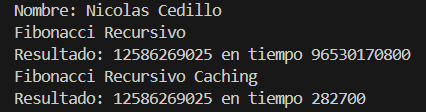

# Práctica de Programación Dinámica

## 📌 Información General

- *Título:* Práctica de Programación Dinámica
- *Asignatura:* Estructura de Datos
- *Carrera:* Computación
- *Estudiante:* Nicolas Cedillo
- *Fecha:* 16 / 07 / 2025
- *Profesor:* Ing. Pablo Torres

---

## 🛠 Descripción

Este proyecto en Java demuestra dos enfoques para calcular el número de Fibonacci:

- *Enfoque Recursivo:* Implementación simple y directa de la fórmula de Fibonacci usando recursión.  
  ⚠ Nota: Este método es ineficiente para valores grandes de n por la explosión combinatoria de llamadas recursivas.
- *Enfoque con Programación Dinámica (Memoización):* Utiliza una estructura HashMap para guardar resultados de subproblemas ya resueltos y evitar cálculos repetidos, optimizando así el tiempo de ejecución.

Se compara el tiempo de ejecución de ambos métodos al calcular el mismo número de Fibonacci.

```java
public class EjerciciosPD {

    public long getFibonacci(int n){
        if(n <=1){
            return n;
        }
        return getFibonacci(n-1) + getFibonacci(n-2);
    }

    public long getFibonacciPD(int n){
        Map<Integer,Long> cache = new HashMap<>();
        return getFibonacciPDHelper(n, cache);
    }

    private long getFibonacciPDHelper(int n, Map<Integer,Long> cache){
        if(n<=1){
            return n;
        }

        if(cache.containsKey(n)){
            return cache.get(n);
        }

        long resultado = getFibonacciPDHelper(n-1, cache) + getFibonacciPDHelper(n-2, cache);
        cache.put(n,resultado);

        return resultado;
    }
}
```

## Codigo Recorridos del labertinto

### 2 Direcciones
```java
import java.util.ArrayList;
import java.util.List;

public class MazeSolverRecursivo implements MazeSolver {

    @Override
    public List<Cell> getPath(boolean[][] grid, Cell start, Cell end) {
        List<Cell> path = new ArrayList<>();
        if (grid == null || grid.length == 0) {
            return path;
        }
        if (findPath(grid, start, end, path)) {
            return path;
        }
        return new ArrayList<>();
    }

    private boolean findPath(boolean[][] grid, Cell start, Cell end, List<Cell> path) {
        int row = start.row;
        int col = start.col;

        if (row >= grid.length || col >= grid[0].length || !grid[row][col]) {
            return false;
        }

        if (row == end.row && col == end.col) {
            path.add(start);
            return true;
        }

        if (findPath(grid, new Cell(row + 1, col), end, path)) {
            path.add(start);
            return true;
        }
        if (findPath(grid, new Cell(row, col + 1), end, path)) {
            path.add(start);
            return true;
        }

        return false;
    }

}
```

### 4 Direcciones

```java
import java.util.ArrayList;
import java.util.List;

public class MazeSolverCompletoRecursivo implements MazeSolver{
    @Override
    public List<Cell> getPath(boolean[][] grid, Cell start, Cell end) {
        List<Cell> path = new ArrayList<>();
        if (grid == null || grid.length == 0) {
            return path;
        }
        boolean[][] visited = new boolean[grid.length][grid[0].length];
        if (findPath(grid, start, end, path, visited)) {
            return path;
        }
        return new ArrayList<>();
    }

    private boolean findPath(boolean[][] grid, Cell start, Cell end, List<Cell> path, boolean[][] visited) {
        int row = start.row;
        int col = start.col;

        if (row < 0 || row >= grid.length || col < 0 || col >= grid[0].length || 
            !grid[row][col] || visited[row][col]) {
            return false;
        }

        visited[row][col] = true;

        if (row == end.row && col == end.col) {
            path.add(start);
            return true;
        }

        if (findPath(grid, new Cell(row + 1, col), end, path, visited) ||
            findPath(grid, new Cell(row, col + 1), end, path, visited) ||
            findPath(grid, new Cell(row - 1, col), end, path, visited) ||
            findPath(grid, new Cell(row, col - 1), end, path, visited)) {
            path.add(start);
            return true;
        }

        visited[row][col] = false;
        return false;
    }

}
```

---

## 🧪 Estructura

- EjerciciosPD.java: Clase que contiene los métodos para calcular el Fibonacci de forma recursiva y con memoización.
- App.java: Punto de entrada que ejecuta ambos métodos y muestra los resultados y tiempos de ejecución en consola.

---


## 🚀 Ejecución

Para ejecutar el proyecto:

1. Compila el código:
    bash
    javac App.java
    
2. Ejecuta la aplicación:
    bash
    java App
    

---

## 🧑‍💻 Ejemplo de Salida

```plaintext
Nombre: Nicolas Cedillo
Fibonacci Recursivo 
Resultado: 12586269025 en tiempo 96530170800
Fibonacci Recursivo Caching
Resultado: 12586269025 en tiempo 282700
```

---

## 📄 Tiempos

### Imagen de Tiempos de Ejecución



### Codigo
```java
    private static void runEjerciciosPD() {
        EjerciciosPD ejerciciosPD = new EjerciciosPD();
        System.out.println("Fibonacci Recursivo");
        long start = System.nanoTime()/1;
        long resultado = ejerciciosPD.getFibonacci(50);
        long end = System.nanoTime()/1;
        long duration = end - start;
        System.out.println("Resultado: " + resultado + " en tiempo " + duration);

        System.out.println("Fibonacci Recursivo Caching");
        start = System.nanoTime()/1;
        resultado = ejerciciosPD.getFibonacciPD(50);
        end = System.nanoTime()/1;
        duration = end - start;
        System.out.println("Resultado: " + resultado + " en tiempo " + duration);

        // Con n=5, es mas lento porque le toma tiempo crear el mapa
    }
```
---
